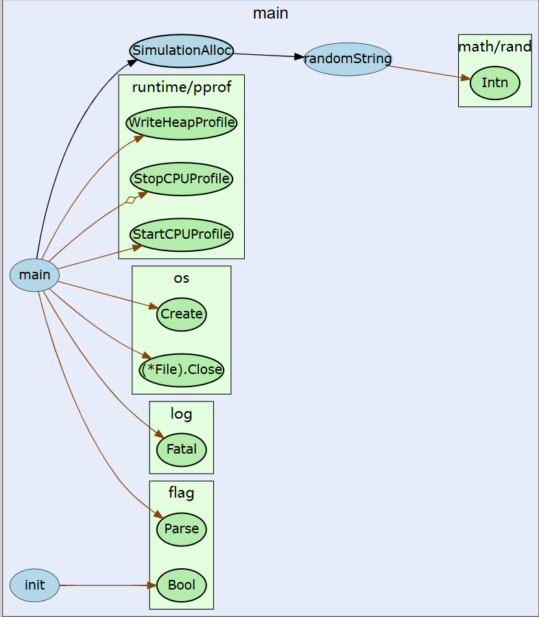

# go-callvis Go代码调用链路可视化工具
https://github.com/ofabry/go-callvis
与链路追踪（Tracing）不同，Tracing关注复杂的分布式环境中各个服务节点间的调用关系，主要用于服务治理。而我们本次探索的代码调用链路则是代码方法级别的调用关系，主要用于代码设计。
可视化工具可以将代码间的调用关系通过图表的方式展示出来，如下图（来自go-callvis工具）

## 示例
```Go
package main

import (
	"flag"
	"log"
	"math/rand"
	"os"
	"runtime/pprof"
)

var cpuprofile = flag.Bool("cpu", false, "write cpu profile to file")
var memprofile = flag.Bool("mem", false, "write cpu profile to file")

func main() {
	flag.Parse()
	// 创建cpu分析文件
	if *cpuprofile {
		f, err := os.Create("./main-cpu.prof")
		if err != nil {
			log.Fatal(err)
		}
		pprof.StartCPUProfile(f)
		defer pprof.StopCPUProfile()
	}

	SimulationAlloc()
	// 创建内存分析文件,放在后面才能采集到内存分配信息
	if *memprofile {
		f, err := os.Create("./main-mem.prof")
		if err != nil {
			log.Fatal(err)
		}
		pprof.WriteHeapProfile(f)
		f.Close()
	}
}

// SimulationAlloc 模拟分配内存
func SimulationAlloc() string {
	s := ""
	for i := 0; i < 100; i++ {
		for j := 0; j < 10; j++ {
			s += randomString(1000)
		}
	}
	return s
}

const letterBytes = "abcdefghijklmnopqrstuvwxyzABCDEFGHIJKLMNOPQRSTUVWXYZ"

func randomString(n int) string {
	b := make([]byte, n)
	for i := range b {
		b[i] = letterBytes[rand.Intn(len(letterBytes))]
	}
	return string(b)
}
```
`go-callvis main.go` 执行命令会出现host地址,浏览器打开即可显示
`go-callvis -nostb main.go` 不显示标准库
`go-callvis /pacpage` 指定package
`go-callvis -tests /pacpage` 指定test package
