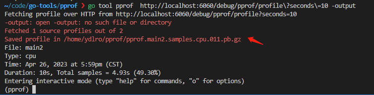

# Go语言自带的分析性能工具pprof

Go 语言内置库里就自带了性能分析库 pprof。pprof 有两个包用来分析程序： runtime/pprof 与 net/http/pprof，其中 net/http/pprof 只是对 runtime/pprof 包进行封装并用 http 暴露出来。runtime/pprof 用于对普通的应用程序进行性能分析，主要用于可结束的代码块，比如一次函数调用；而 net/http/pprof 专门用于对后台服务型程序的性能采集与分析。

**runtime/pprof 代码块**
```go
package main

import (
	"flag"
	"log"
	"math/rand"
	"os"
	"runtime/pprof"
)

var cpuprofile = flag.Bool("cpu", false, "write cpu profile to file")
var memprofile = flag.Bool("mem", false, "write cpu profile to file")

func main() {
	flag.Parse()
	// 创建cpu分析文件
	if *cpuprofile {
		f, err := os.Create("./main-cpu.prof")
		if err != nil {
			log.Fatal(err)
		}
		pprof.StartCPUProfile(f)
		defer pprof.StopCPUProfile()
	}

	SimulationAlloc()
	// 创建内存分析文件,放在后面才能采集到内存分配信息
	if *memprofile {
		f, err := os.Create("./main-mem.prof")
		if err != nil {
			log.Fatal(err)
		}
		pprof.WriteHeapProfile(f)
		f.Close()
	}
}

// SimulationAlloc 模拟分配内存
func SimulationAlloc() string {
	s := ""
	for i := 0; i < 100; i++ {
		for j := 0; j < 10; j++ {
			s += randomString(1000)
		}
	}
	return s
}

const letterBytes = "abcdefghijklmnopqrstuvwxyzABCDEFGHIJKLMNOPQRSTUVWXYZ"

func randomString(n int) string {
	b := make([]byte, n)
	for i := range b {
		b[i] = letterBytes[rand.Intn(len(letterBytes))]
	}
	return string(b)
}

```
`go build -o main main.go ` 构建程序
`./main -cpu -mem` 执行之后在当前文件夹生成`main-cpu.prof, main-mem.prof`文件

## 分析数据
### 浏览器(推荐)
`go tool pprof -http=:端口号 生成的分析文件`
**界面视图**

**火焰图视图**
分析耗时的方法名

**源码视图**
可以查看到43行耗时的代码

#### cpu分析
`go tool pprof -http=:9999 main-cpu.prof` 浏览器打开cpu分析文件, 箭头线上的数字代表执行耗时
cpu分析文件部分截图

#### mem分析
`go tool pprof -http=:9998 main-mem.prof` 浏览器打开mem分析文件, 箭头线上的数字代表分配内存
mem分析文件部分截图


### 终端命令
`go tool pprof main main-cpu.prof`


上图中，其他的一些参数解释如下：

- Duration：程序执行时间。多核执行程序，总计耗时 301.35ms，而采样时间为 150ms,假设有3核执-行该程序,则平均每个核采样50ms数据。
- flat/flat%：分别表示在当前层级cpu的占用时间和百分比。例如runtime.memmove在当前层级占用cpu时间60ms，占比本次采集时间的40%。
- cum/cum%：分别表示截止到当前层级累积的cpu时间和占比。例如main.SimulationAlloc累积占用时间70ms，占本次采集时间的46.67%。
- sum%：所有层级的 CPU 时间累积占用，从小到大一直累积到100%,即150ms.
- (pprof)：命令行提示, 使用help查看更多。表示当前在go tool 的pprof工具命令行中, go tool还包括cgo、doc、pprof、test2json、trace等多种命令

`top5 -cum` 按cum条件列出前5个,可以发现途中main.SimulationAlloc占用最多


`list main.SimulationAlloc` 可以查看源码和执行信息,可以查看得知代码在43行耗时最多


## net/http/pprof 分析web服务
```go
package main

import (
	"fmt"
	"math/rand"
	"net/http"
	_ "net/http/pprof"
)

func main() {
	http.HandleFunc("/", SimulationAlloc)
	http.ListenAndServe(":6060", nil)
}

// SimulationAlloc 模拟分配内存
func SimulationAlloc(w http.ResponseWriter, r *http.Request) {
	s := ""
	for i := 0; i < 100; i++ {
		for j := 0; j < 10; j++ {
			s += randomString(1000)
		}
	}
	fmt.Println(s)
}

const letterBytes = "abcdefghijklmnopqrstuvwxyzABCDEFGHIJKLMNOPQRSTUVWXYZ"

func randomString(n int) string {
	b := make([]byte, n)
	for i := range b {
		b[i] = letterBytes[rand.Intn(len(letterBytes))]
	}
	return string(b)
}
```
运行程序,分析结果
```bash
go run main.go

go tool pprof http://localhost:6060/debug/pprof/profile\?seconds\=30 #新开终端执行分析
cpu 
```


执行`top5 -cum` 查看耗时方法
执行`list main.SimulationAlloc` 定位耗时方法,处于第20行的代码


也可以通过执行`svg`在当前文件下生成svg文件或使用`web`,使用浏览器打开查看

因为web服务没有创建分析文件,需要执行`go tool pprof  http://localhost:6060/debug/pprof/profile\?seconds\=10 -output` 同时执行`wrk -c 10 -t 2 -d 10s http://localhost:6060/` 发起请求,收集数据分析,生成的文件自动Saved

执行`go tool pprof -http=:9999 xxxx.pb.gz`在浏览器打开分析数据(火焰图, 图表等)

更多操作, 参考：https://pkg.go.dev/net/http/pprof#hdr-Usage_examples
使用 pprof 工具查看堆剖析：

`go tool pprof http://localhost:6060/debug/pprof/heap`
如果要查看 30 秒的 CPU 剖析：

`go tool pprof http://localhost:6060/debug/pprof/profile?seconds=30`
如果要查看 goroutine 阻塞情况的剖析，在程序中调用 runtime.SetBlockProfileRate 后：

`go tool pprof http://localhost:6060/debug/pprof/block`
如果要查看互斥锁争用的持有者，在程序中调用 runtime.SetMutexProfileFraction 后：

`go tool pprof http://localhost:6060/debug/pprof/mutex`
该包还导出一个处理程序，为 "go tool trace" 命令提供执行跟踪数据。要收集 5 秒钟的执行跟踪：

`curl -o trace.out http://localhost:6060/debug/pprof/trace?seconds=5`
`go tool trace trace.out`

### 总结
例子：使用go-callvis 执行go代码，获取程序调用链，加载过程中出现比较慢的情况，需要对go-callvis进行分析，分析性能瓶颈

### Trace
参考：https://tonybai.com/2021/06/28/understand-go-execution-tracer-by-example/